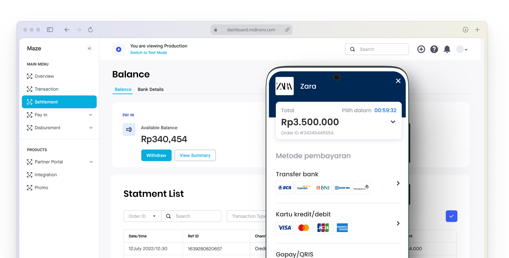

# Payment Gateway

<p align="center"><a href="https://laravel.com" target="_blank"></a></p>

<p align="center">
<a href="https://travis-ci.org/laravel/framework"></a>
<a href="https://packagist.org/packages/laravel/framework"></a>
<a href="https://packagist.org/packages/laravel/framework"></a>
<a href="https://packagist.org/packages/laravel/framework"></a>
</p>

```sh
 code .
 cp .env.example .env
 composer install
 sudo apt-get install php7.4-pgsql php7.4-dom php7.4-gd
 composer install
 php artisan key:generate
 php artisan migrate --seed
 php artisan serve
 php artisan db:seed --class=UserSeeder
 php artisan serve
 php artisan 
 php artisan jwt:secret
 sudo chmod -R 777 storage
```

## Midtrans Documentations
- https://docs.midtrans.com/docs/testing-payment-on-sandbox?id=bank-transfer


